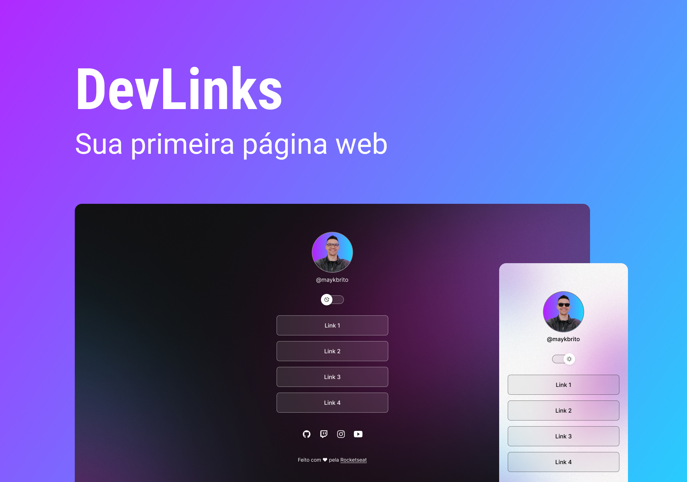

<h1 align="center"> DevLinks </h1>

Programma esclusivo e gratuito, dato dalla Rocketseat per insegnamento di tecnologia WEB. 
<a href="https://lp.rocketseat.com.br/devlinks/inscricao?utm_source=github&utm_medium=descricao&utm_campaign=capture-devlinks&utm_term=organic&utm_content=descricao-github-mayk-brito">Studia questo progetto in formato di video cliccando qui.</a>

  <a href="#-tecnologias">Tecnologie</a>&nbsp;&nbsp;&nbsp;|&nbsp;&nbsp;&nbsp;
  <a href="#-projeto">Progetto</a>&nbsp;&nbsp;&nbsp;|&nbsp;&nbsp;&nbsp;
  <a href="#-layout">Layout</a>&nbsp;&nbsp;&nbsp;|&nbsp;&nbsp;&nbsp;
  <a href="#memo-licença">Licenza</a>

  

 

  

## 🚀 Tecnologias

Questo progetto è stato creato con le seguenti Tecnologie:

- HTML e CSS
- JavaScript
- Git e Github
- Figma

## 💻 Projeto

Il DevLinks é un agregatore di link da usare come biglietto da visita.

- [Acesse o projeto finalizado, online](https://maykbrito.github.io/devlinks)

- [Assistir aulas](https://lp.rocketseat.com.br/devlinks/inscricao?utm_source=github&utm_medium=descricao&utm_campaign=capture-devlinks&utm_term=organic&utm_content=descricao-github-mayk-brito)

## 🔖 Layout

Puoi visualizzare il layout del progetto attraverso [DESSE LINK](https://www.figma.com/community/file/1187422022288947321). É necessario avere un account [Figma](https://figma.com) per accedere.

## :memo: Licença

Questo proggetto e sotto licenza MIT.

---

Fatto con ♥ by Rocketseat :wave: [Participe da nossa comunidade!](https://discord.gg/rocketseat)
